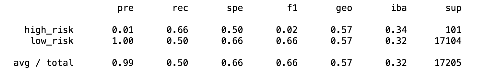

# Mod-17

Overview:
Credit risk is an inherently unbalanced classification problem, as good loans easily outnumber
risky loans.
Results: Using bulleted lists, describe the balanced accuracy scores and the precision and recall
scores of all six machine learning models. Use screenshots of your outputs to support your
results.
Oversampling
We were able to train the data to adjust the class distribution of data.
Naïve Random Oversampling
Trained the data and calculate with random oversampling.
SMOTE Oversampling
Trained the data using logistic regression model using the resampled date.

Undersampling

Combination Over & Under Sampling
Test a combination over- and under-sampling algorithm to determine if the algorithm results
in the best performance compared to the other sampling algorithms above.
Summary:
I favored using the oversampling model, using the training, converting the tragets the results
were good.